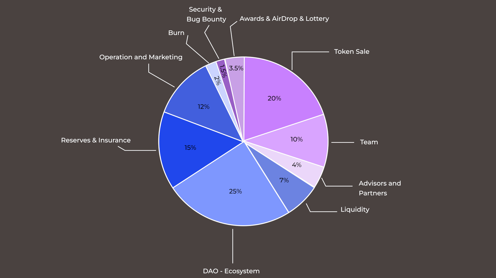

Tokenomics refers to the economic structure and incentive mechanisms that govern token creation, distribution, and management within a blockchain ecosystem. It encompasses the token supply, allocation, and usage design to ensure the network's sustainability and growth. Effective tokenomics align stakeholders' interests, encourage participation, and support the overall functionality and security of the blockchain platform.

## Token Metrics

<table class="customTable1">
  <tbody>
    <tr>
      <td>Ticker</td>
      <td><strong>JNFTC</strong></td>
    </tr>
    <tr>
      <td>Token Chain</td>
      <td>Jumbochain</td>
    </tr>
    <tr>
      <td>Total Supply</td>
      <td>125,000,000</td>
    </tr>
    <tr>
      <td>Initial Token Circulation</td>
      <td>03,375,950</td>
    </tr>
    <tr>
      <td>Initial Market Cap</td>
      <td>$ 3,375,950</td>
    </tr>
  </tbody>
</table>

## Token Allocation

<table class="customTable ">
  <tbody>
    <tr>
      <td>Token Sale</td>
      <td>25,000,000</td>
    </tr>
    <tr>
      <td>Team</td>
      <td>12,500,000</td>
    </tr>
    <tr>
      <td>Advisors & Partners</td>
      <td>05,000,000</td>
    </tr>
    <tr>
      <td>Liquidity</td>
      <td>08,750,000</td>
    </tr>
    <tr>
      <td>DAO-Ecosystem</td>
      <td>31,250,000</td>
    </tr>
    <tr>
      <td>Reserves & Insurance</td>
      <td>18,750,000</td>
    </tr>
    <tr>
      <td>Operation & Marketing</td>
      <td>15,000,000</td>
    </tr>
    <tr>
      <td>Burn</td>
      <td>02,500,000</td>
    </tr>
    <tr>
      <td>Security & Bug Bounty</td>
      <td>01,875,000</td>
    </tr>
    <tr>
      <td>Awards & Airdrop Lottery</td>
      <td>04,375,000</td>
    </tr>
    <tr>
      <td><strong>Total JNFTC</strong></td>
      <td><strong>25,000,000</strong></td>
    </tr>
  </tbody>
</table>

## Token Distribution - Initial Token Circulation

| Description | Allocation | Amount | Lock & Vesting | Inital Circulation |
| ---- | --------------- | ------------- | ------------------------ | ------------- |
| Token Sale | 20% | 25,000,000 | See Sale Distribution | 0 |
| Team | 10% | 12,500,000 | 0% unlocked ar TGE, then cliff for 12 months, then linear unlock for 120 months | 0 |
| Advisors & Partners | 04% | 5,000,000 | 0% unlocked ar TGE, then cliff for 8 months, then linear unlock for 120 months | 0 |
| Liquidity | 07% | 8,750,000 | 1% unlocked ar TGE, then cliff for 0 months, then linear unlock for 11 months | 0 |
| DAO-Ecosystem | 25% | 31,250,000 | 0% unlocked ar TGE, then cliff for 12 months, then linear unlock for 120 months | 87,500 |
| Reserve & Insurance | 15% | 18,750,000 | 0% unlocked ar TGE, then cliff for 12 months, then linear unlock for 120 months | 0 |
| Operation & Marketing | 12% | 15,000,000 | 4% unlocked ar TGE, 96% locked for 2 month, then 2% unlock each month | 0 |
| Burn | 02% | 2,500,000 | 0% An updated document will be attached in favor of a burn map | 0 |
| Security & Bug Bounty | 1.5% | 1,875,000 | 0% unlocked at TGE, then cliff for 2 months, then linear unlock for 60 months | 0 |
| Awards & Airdrop & Lottery | 3.5% | 4,375,000 | 4% unlocked ar TGE, 96% locked for 2 month, then linear unlock for 60 months | 1,75,000 |
| **Total Supply** | **100.00%** | **125,000,000** |    | **3,200,950** |

## Sale Distribution - Initial Token Circulation

| Description | Allocation | Amount | Token Price | Total in USDT | Lock & Vesting | Inital Circulation |
| ---- | --------------- | ------------- | ------------------------ | ------------- | ------ | ------- |
| Angel Round | 11.33% | 2,832,500 | $0.10 | $283,250 | 0% unlocked at TGE, then cliff for 6 months, then linear unlock for 32 months | 0 |
| Pre-Seed | 11.33% | 2,832,500 | $0.25 | $708,125 | 0% unlocked at TGE, then cliff for 4 months, then linear unlock for 28 months | 0 |
| Private Round | 30.12% | 7,530,000 | $0.50 | $3,765,000 | 4% unlocked at TGE, then cliff for 3 months, then linear unlock for 24 months | 301,200 |
| IDO | 5.95% | 1,487,500 | $0.75 | $1,115,625 | 10% unlocked at TGE, then cliff for 1 months, then linear unlock for 18 months | 148,750 |
| IEO & ILO | 41.27% | 10,317,500 | $ 1.00 | $10,317,500 | 20% unlocked at TGE, then cliff for 1 months, then linear unlock for 12 months | 2,063,500 |
| **Total** | **100.00%** | **25,000,000** |  | **$16,189,500** |  | **2,513,450** |
