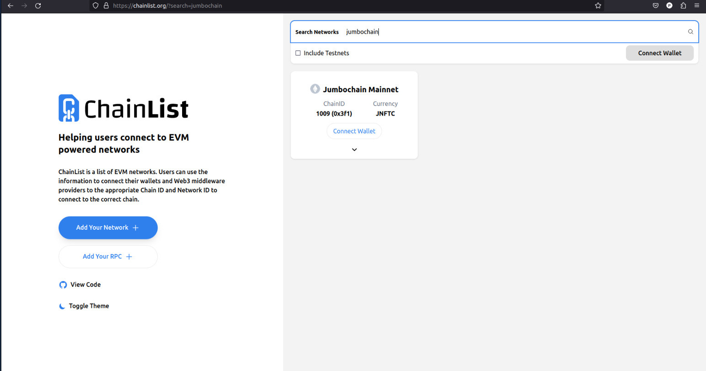
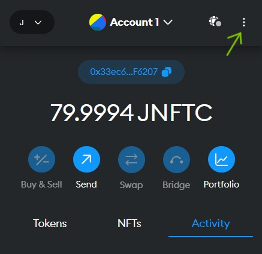
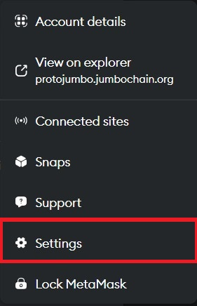
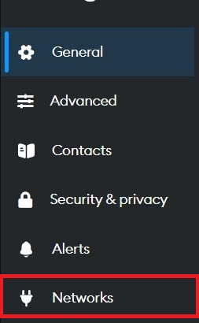
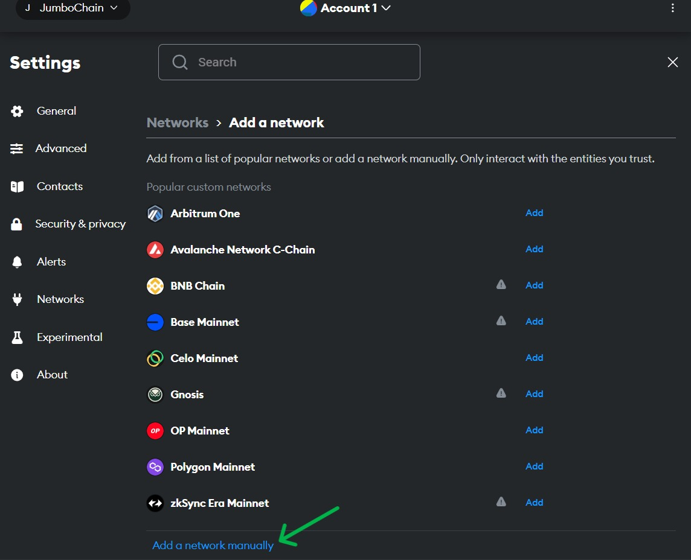
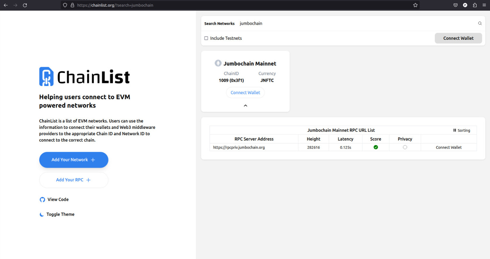
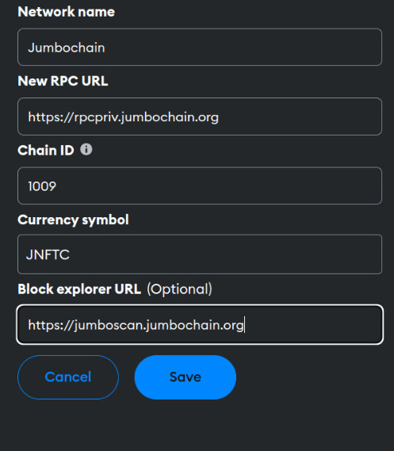
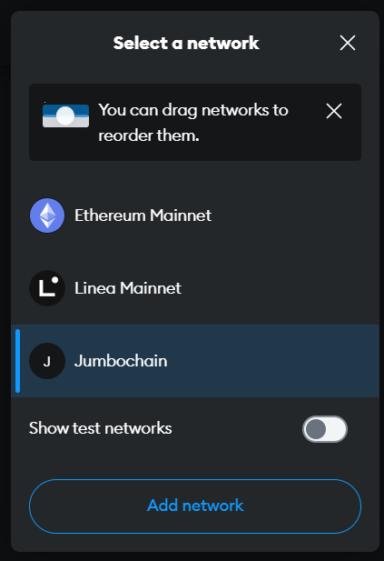

# Connecting your wallet with the Jumbo Blockchain network

You need a metamask wallet to connect with the jumbo blockchain network, open your metamask or get it [here](https://metamask.io/download/)

<!-- :::info
Jumbochain only supports MetaMask version 11.16.0 or older version
::: -->

## How to download Metamask manually

**Step-1 Download Metamask version 11.16.0 [Link](https://github.com/MetaMask/metamask-extension/releases/tag/v11.16.0) or older version [Link](https://github.com/MetaMask/metamask-extension/releases?page=4).**

**Step-2 Extract downloaded Metamask file.**

<iframe
  width="100%"
  height="300"
  src="https://csct-assets.infura-ipfs.io/ipfs/QmPJcye9ASbAkx8bT2gF4YF6ettxk5rowCTZbv9FxpSDKM"
  frameBorder="0"
  allow="accelerometer; autoplay; clipboard-write; encrypted-media; gyroscope; picture-in-picture"
  allowFullScreen>
</iframe>

**Step-3 Open Chrome, and type “chrome://extensions” in the browser URL bar.**

**Step-4 Click "Load Unpacked".**

**Step-5 On the window pop up, open the the folder unzipped earlier.**

<iframe
  width="100%"
  height="810"
  src="https://csct-assets.infura-ipfs.io/ipfs/QmeM7dyrhp73o1xtgaZqpVuQihpzHpUtffkWgytepazY4p"
  frameBorder="0"
  allow="accelerometer; autoplay; clipboard-write; encrypted-media; gyroscope; picture-in-picture"
  allowFullScreen>
</iframe>

**Step-6 MetaMask should now be installed.**

## Add Wallet

**You can either add the wallet directly to the metamask or manually.**

- Go to the [chainlist](https://chainlist.org/?testnets=true&search=jumbochain).

  

- Click on the `Connect Wallet` button.

- You will get the prompt to approve the connection. Provide the required permission.

- Now you have successfully added the **Jumbo Blockchain** network to the wallet.

:::info
If you are facing difficulty in adding the network in the above mentioned method, you can try adding it manually.
:::

## Add Network

- Select the `account` you want to send a transaction from and click on the `options` button.  

  

- Select the `Setting`>`Networks`>`Add Network`>`Add a network manually`.  

   &nbsp;

   &nbsp;

  

  

## Getting Network Details

- To get the required network details visit: [ChainList](https://chainlist.org/?testnets=true&search=jumbochain)  

  

- Here you can get the `chain ID`, `Currency symbol`, `RPC URL`. You can add the network name as `Jumbo Blockchain`.  

  [Jumboscan URL](https://jumboscan.jumbochain.org/)

  

- Now you have successfully filled the network details and added the network to your wallet by clicking on the `Save` button.

- Switch to the `Jumbo Blockchain` network by clicking on the indicated icon and from the drop-down menu select the `Jumbo Blockchain` network you have just added.  

  

- Now you have successfully added the network to your wallet and are ready to do transactions on the **Jumbo Blockchain**.
