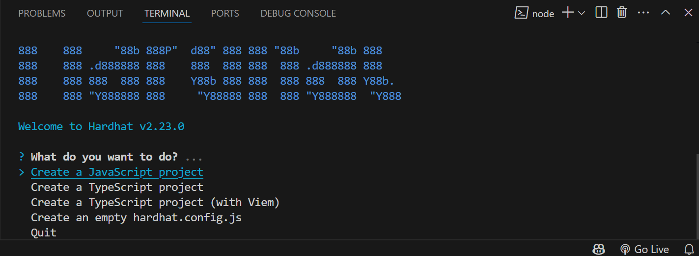
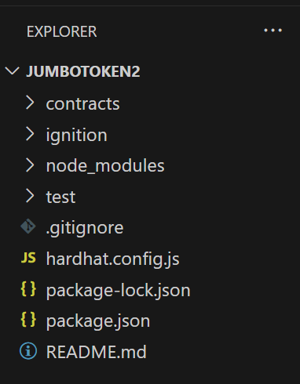
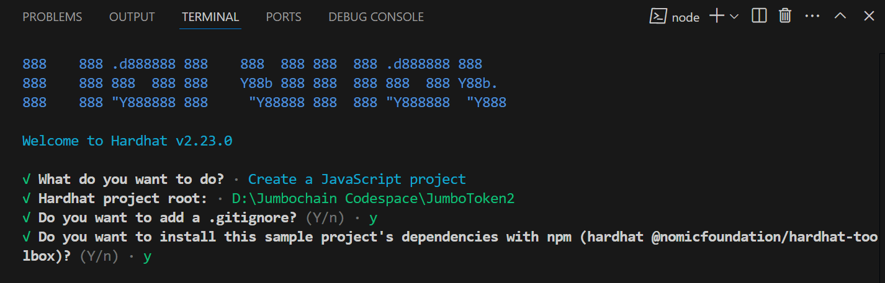
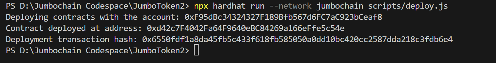
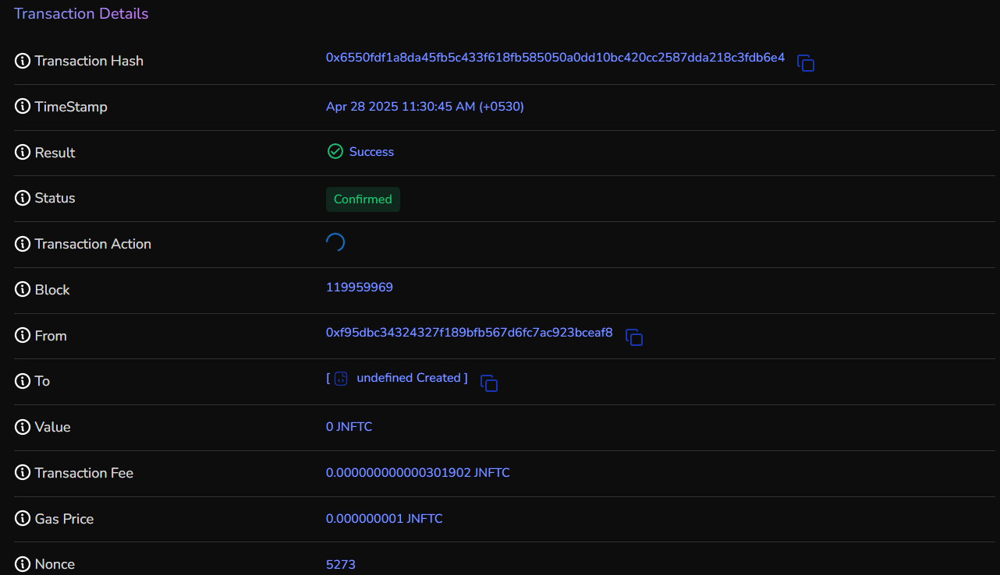

## Installation of Hardhat

- **Open Visual Studio Code**: Launch Visual Studio Code once it's installed on your system, get it from [here](https://code.visualstudio.com/download)
- **Open a New Terminal**: In Visual Studio Code, open a new terminal window by selecting Terminal > New Terminal from the top menu, or by pressing `` Ctrl + ` `` (backtick).
- **Install Node.js and npm**: Ensure you have Node.js and npm installed on your system. You can download and install them from the official [Node.js](https://nodejs.org/) website.

Initialize empty node.js project

```bash
npm init --y
```

- **Install Hardhat globally**: In the terminal window within Visual Studio Code, run the following npm command to install Hardhat globally on your system:<br></br>

```bash
npm install -g hardhat
```

- **Verify Installation**: After the installation is complete, you can verify that Hardhat has been installed successfully by running the following command:

```bash
npx hardhat --version
```

- Once Hardhat is successfully installed , you can start developing smart contracts using Hardhat.

## Configuring Hardhat

- **Initialize Hardhat Project** (Optional): If you want to start a new Hardhat project, navigate to the directory where you want to create the project in the terminal and run:

```bash
npx hardhat init
```

- Hardhat will prompt you to choose a project type: `Create an empty hardhat.config.js` , `Create a JavaScript Project`, `Create a TypeScript project`, `Create a TypeScript project (with Viem)` or `Quit` .<br></br>

  

- The `create a empty hardhat.config.js` option will add just the `hardhat.config.js` and `package.json file`.

  

- `Create a JavaScript Project`, `Create a TypeScript project`, or `Create a TypeScript project (with Viem)`, will add all the required project files according to the selected javascript/typescript language for your project.<br></br>

  

- You can select any template of your preference, here we have selected `create a Javascript project`,
Hardhat will set up the necessary project structure and configuration files.<br></br>

  

:::note
The `create a typescript project` option will create the same structure, just with typescript deploy and config file.
:::

- **Configuration File Setup**: Create or modify the Hardhat configuration file `hardhat.config.js` to include settings specific to the Jumbo Blockchain network. This may involve specifying the network name, endpoint URL, chain ID, and other relevant parameters required to connect to the Jumbo Blockchain node.<br></br>

```javascript title="hardhat.config.js"
require("@nomicfoundation/hardhat-toolbox");
const privatekey = "Enter_Your_Private_Key"; //Private Key of your metamask
// wallet from which the transaction will be called.

module.exports = {
  solidity: {
    compilers: [
      // Specify the different versions of compiler you have used in your contracts
      {
        version: "0.8.26", // you can adjust the compiler version as per your needs
        settings: {
          // optional
          optimizer: { enabled: true, runs: 800 },
          evmVersion: "istanbul",
          viaIR: true,
        },
      },
      {
        version: "0.8.24", // version can be adjusted
        settings: {
          optimizer: { enabled: true, runs: 800 },
          evmVersion: "paris",
          viaIR: true,
        },
      },
    ],
  },

  networks: {
    jumbochain: {
      url: `https://testnode.jumbochain.org`, // RPC URL which you can get from
      //the chainlist, as mentioned in the documentation.
      accounts: [`${privatekey}`],
    },
  },
}

```

- **Account Configuration**: Configure accounts to be used for deploying smart contracts and interacting with the Jumbo Blockchain network. You may specify the private keys or mnemonic phrases of accounts authorized to perform transactions on the network. Ensure that these accounts have sufficient funds contract deployment.

- **Network Configuration**: `networks` is an optional object for mapping the network to their configuration.

  Here we define the JSON-RPC network in hardhat for connecting that hardhat
  with the Jumbo Blockchain network through the RPC_URL. You can find details for protojumbo testnet [here](https://chainlist.org/?testnets=true&search=protojumbo).
  You can also search for Jumbochain Mainnet on chainlist.

  In the `accounts` field defines the account to be used for the deployment of the contracts, You need to set the account private key in `privatekey`.

  :::warning
  Ensure you have some JNFTC in your account for the contract deployment
  :::

- **Compiler Configuration**: Optionally, configure the Solidity compiler settings in the Hardhat configuration file to match the version compatibility with Jumbo Blockchain.

  This ensures that smart contracts are compiled using the appropriate compiler version compatible with the Jumbo Blockchain network.

- Open the terminal or command prompt and navigate to the project directory.

:::tip

Before you compile the contracts you need to install all the dependencies required. You can do so by running:

```bash
npm i
```

or, If you face errors while running the above command, try force running this command.

```bash
npm i -f
```

:::

## Developing Smart Contracts

- Add your smart contracts in the `Contracts` folder, you can either upload or write the contracts there in solidity.

- Execute the following command provided by Hardhat to compile your contracts :

## Compiling Smart Contracts

```bash
npx hardhat compile
```

- When you run **npx hardhat compile** in your terminal or command prompt, Hardhat will locate the Solidity files (**.sol** files) in your projects `Contracts` directory, compile them, and generate corresponding bytecode, ABI (Application Binary Interface), and other artifacts needed for deployment and interaction with the smart contracts.

:::info
Upon successful compilation you will notice the generation of two files in the project directory `artifacts` and `cache`.
:::

## Deploying Smart Contracts

- Configure the `deploy.js` file, created by default upon the hardhat to automate the deployment process under the scripts folder of your project typically.

```javascript title="deploy.js"
const { ethers } = require("hardhat");

async function main() {
  const [deployer] = await ethers.getSigners();
  console.log("Deploying contracts with the account:", deployer.address);

  try {
    const MyContract = await ethers.getContractFactory("MyContract"); // <- you contract name

    const myContract = await MyContract.deploy("Welcome To Jumbochain"); 
    // Pass constructor arguments here if needed

    await myContract.waitForDeployment(); // Wait until deployed

    console.log("Contract deployed at address:", await myContract.getAddress());
    console.log("Deployment transaction hash:", myContract.deploymentTransaction().hash);

  } catch (error) {
    console.error("Deployment failed:", error);
    process.exit(1);
  }
}

main();
```

- Define the deployment tasks within the script, including compiling contracts, deploying them to the specified network, **signing** the contract before deployment and verifying their deployment status.

- You can also deploy multiple contracts together, here we have deployed a single contract named **MyContract**. This contract is saved in the `contracts` folder of your project directory.

- This script handles errors and retries in case of transaction failures or timeouts.

- Execute the following command provided by Hardhat to deploy your contracts, make sure you have first successfully compiled the contracts first :

```bash
npx hardhat run --network jumbochain scripts/deploy.js
```

- you will get the deployer address,transaction hash and contract address as the output.



<!-- ```bash -->
<!-- Deploying contracts with the account: 0x6592927982FF9305a84bDEE6B207f3435ED6CE91 -->
<!-- Contract Address: 0x368e3995aFC3d542ad4A70610ce9CdD37E2Ed183 -->
<!-- Txnhash: 0x7f15a024811d311d980c45641553cfdf29dcb2c4929b4988c246ef425440d53 -->
<!-- ``` -->

## Verifying Your Deployment

- Optionally,we can verify the deployed contracts on the [Jumbo Blockchain explorer](https://protojumbo.jumbochain.org/)
- Enter deployed contract transaction hash.<br></br>


- We can see the transaction details in the window.<br></br>



## Conclusion

With hardhat we can easily deploy smart contracts to jumbochain.
