You will learn how to compile and run the smart contracts written in solidity on the Remix platform.

Remix IDE is a powerful online development environment for creating, testing, and deploying smart contracts. This documentation provides a step-by-step guide on how to deploy a smart contract using Remix IDE.

### Prerequisities

- Access to a web browser with an internet connection.
- Basic knowledge of Solidity programming language.
- Basic understanding of [Jumbo Blockchain](https://jumbochain.org/) and smart contracts.

## Steps

### Accessing Remix IDE

- Open you preferred web browser (Eg, chrome, Edge)
- Navigate to the Remix IDE website: [remix](https://remix.ethereum.org)  

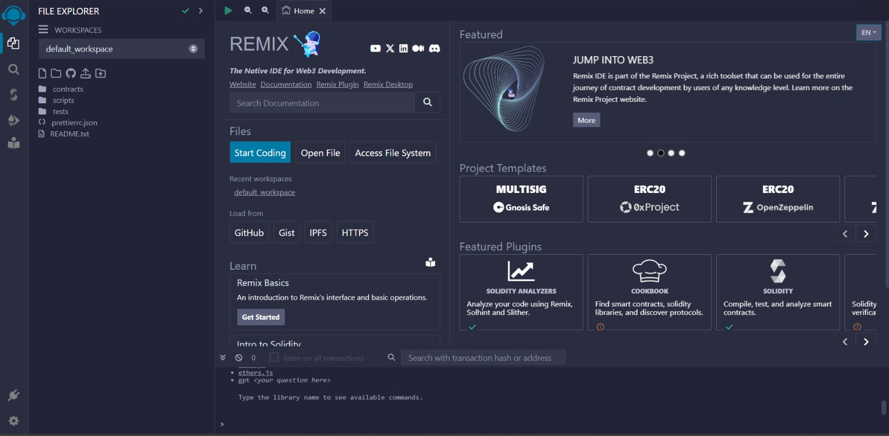

- You should see the Remix IDE interface with different tabs for `writing`, `compiling`, and `deploying` smart contracts.

### Writing the smart contracts

- Click on the `File Explorer` tab on the left sidebar.  

  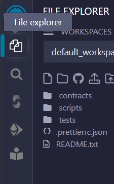

- Click on the create new file button to `create` a new file or `upload` an existing file.  

  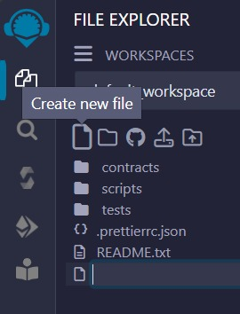

  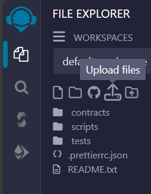

- Write your Solidity smart contract code in the editor area. Ensure your code is syntactically correct.

### Compiling the Smart Contract

- Navigate to the `Solidity Compiler` tab on the left sidebar.  

  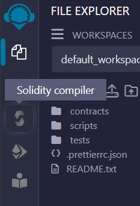

- Select the appropriate compiler version for your smart contract from the dropdown menu.  

  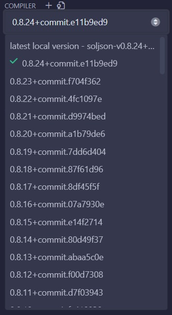

- Go to the `advanced configuration` button.  

  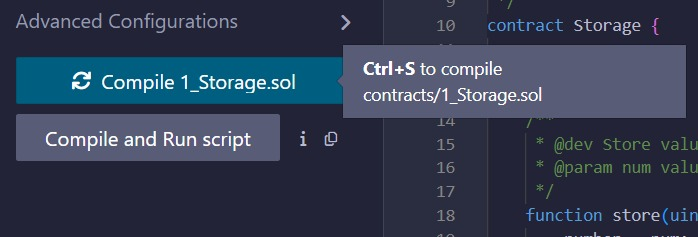

  :::note
  Until the Jumbo Virtual Machine is fully integrated, Jumbo Blockchain will maintain compatibility with the Ethereum Virtual Machine (EVM), allowing developers to utilize any EVM version for their projects on our platform.
  :::

- Now in the `EVM VERSION` option select the `Istanbul` or `Paris`.  

  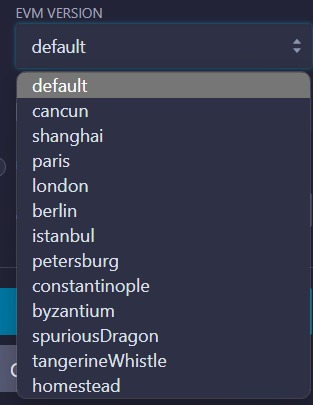

- Click on the `Compile` button to compile your smart contract code. Ensure there are no errors in the compilation output.  

  

- Ensure that your contract is successfully compiled and has no errors.  

  

  This **green tick** indicates that the contract is successfully compiled. Hence the contract is ready to be deployed.

### Deploying your smart contract

- Navigate to the `Deploy & Run Transactions` tab on the left sidebar.  

  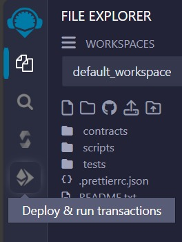

- But before you move further you need to **connect your wallet** with the **Jumbo Blockchain network**. Visit: [The_doc_link](/docs/guides/connect-to-mainnet/connect-with-metamask)

- Now, Select the desired `Environment` for the drop down menu, here you can either choose the `injected provider` or the `Wallet connect` option.  

  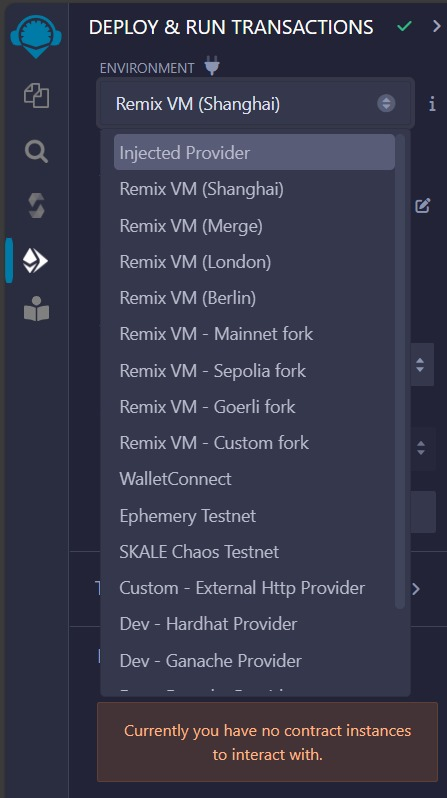

- You will see a **pop-up** from metamask to allow the wallet to be injected, give the required permission and you will be ready to deploy the contract on the Jumbo Blockchain.

- Click on the `Deploy` button to deploy your smart contract to the selected environment.  

  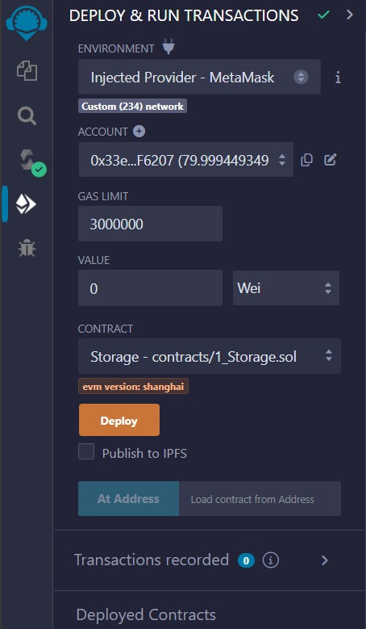

- You will get a pop-up to permit the deployment, click on `confirm` to confirm the transaction.  

  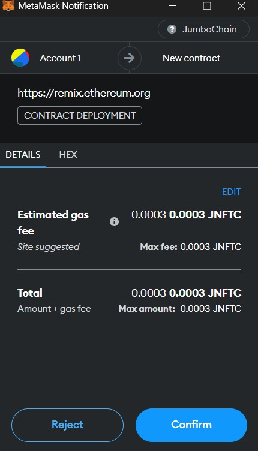

- After successful deployment, you'll see your contract address and transaction details in the console, and the contract address can be fetched from the `Deployed contract` menu.  
  photo

### Interacting with the Deployed Smart Contract

- Once deployed, you can interact with your smart contract using the provided interface in the `Deployed Contracts` tab.   
  photo
- You can call functions, view state variables, and perform various transactions depending on the functionality of your smart contract.

### Verify your deployment

- Now you can get the transaction hash, contract address from the `console` and `deployed contract` menu.  

  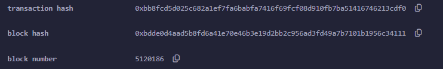

- Visit the: [ProtoJumbo Explorer (Jumbo Blockchain.org)](https://protojumbo.jumbochain.org/)
- Enter your deployed contract transaction hash.  

  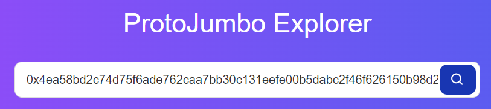

- You can see the transaction details in the window.  

  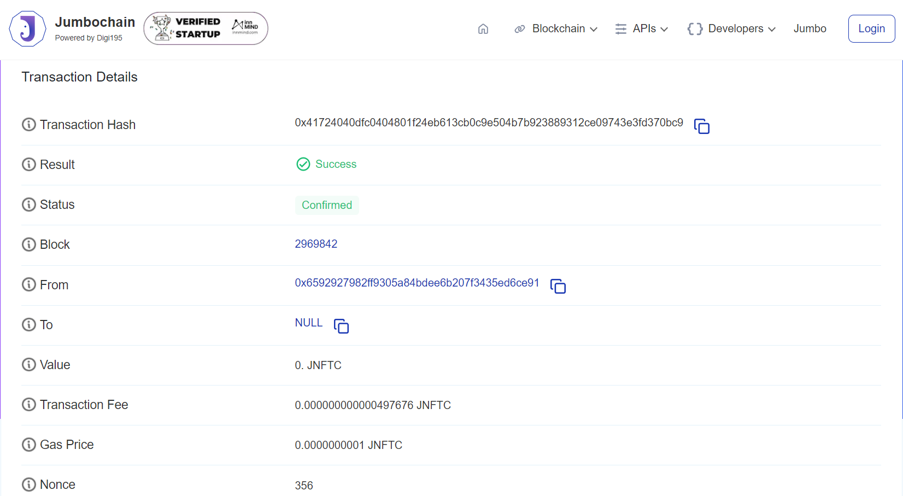
