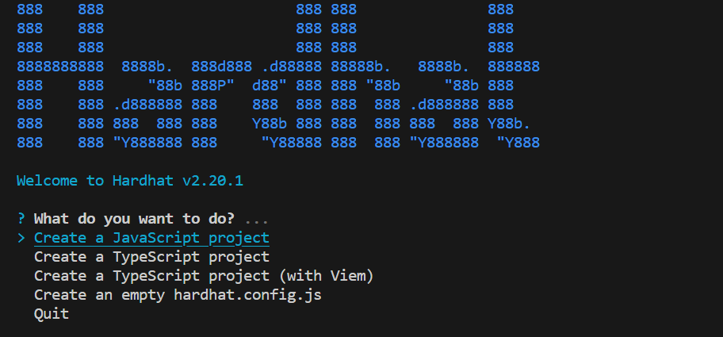
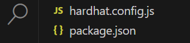
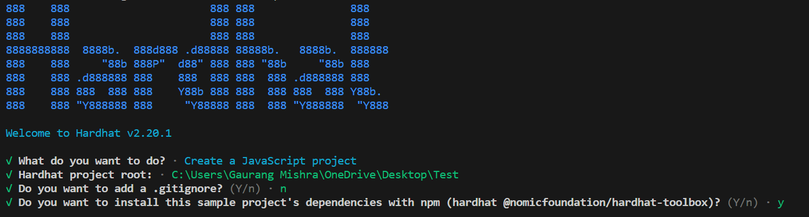
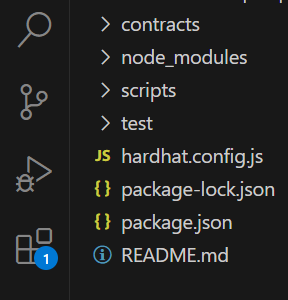
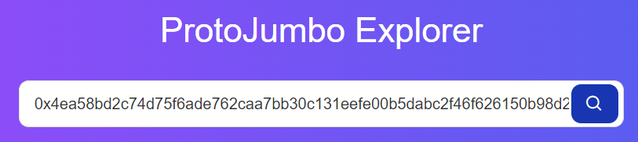
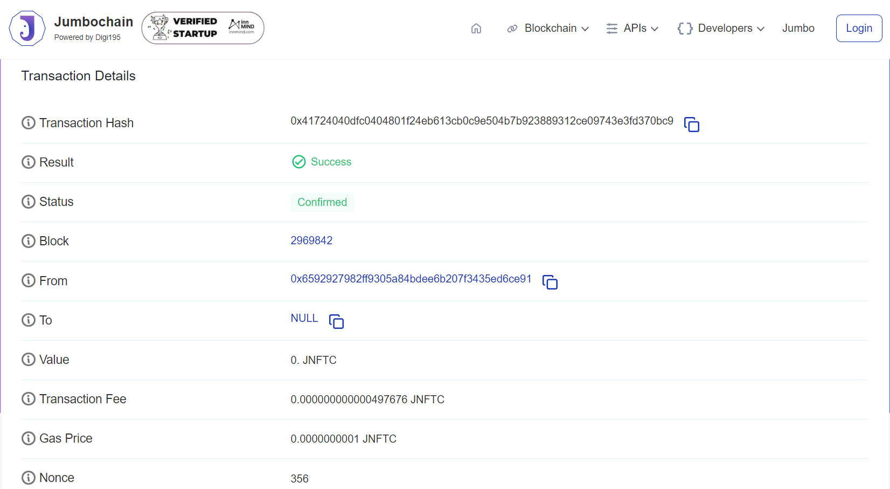

## Installation of Hardhat

- **Open Visual Studio Code**: Launch Visual Studio Code once it's installed on your system, get it from [here](https://code.visualstudio.com/download)
- **Open a New Terminal**: In Visual Studio Code, open a new terminal window by selecting Terminal > New Terminal from the top menu, or by pressing `` Ctrl + ` `` (backtick).
- **Install Node.js and npm**: Ensure you have Node.js and npm installed on your system. You can download and install them from the official [Node.js](https://nodejs.org/) website.

- **Install Hardhat globally**: In the terminal window within Visual Studio Code, run the following npm command to install Hardhat globally on your system:<br></br>

```bash
npm install -g hardhat
```

- **Verify Installation**: After the installation is complete, you can verify that Hardhat has been installed successfully by running the following command:

```bash
hardhat --version
```

- **Initialize Hardhat Project** (Optional): If you want to start a new Hardhat project, navigate to the directory where you want to create the project in the terminal and run:

```bash
hardhat init
```

- Hardhat will prompt you to choose a project type: `Create an empty hardhat.config.js` , `Create a JavaScript Project`, `Create a TypeScript project`, `Create a TypeScript project (with Viem)` or `Quit` .<br></br>

  

- The `create a empty hardhat.config.js` option will add just the `hardhat.config.js` and `package.json file`.

  

- `Create a JavaScript Project`, `Create a TypeScript project`, or `Create a TypeScript project (with Viem)`, will add all the required project files according to the selected javascript/typescript language for your project.<br></br>

  

- You can select any template of your preference, here we have selected `create a Javascript project`, Hardhat will set up the necessary project structure and configuration files.<br></br>

  

:::note
the `create a typescript project` option will create the same structure, just with typescript deploy and config file.
:::

## Start Developing

- Once Hardhat is installed and configured, you're ready to start developing smart contracts using Hardhat.

- Add your smart contracts in the `Contracts` folder, you can either upload or write the contracts there in solidity.

## Configuring Hardhat

- **Configuration File Setup**: Create or modify the Hardhat configuration file `hardhat.config.js` to include settings specific to the Jumbo Blockchain network. This may involve specifying the network name, endpoint URL, chain ID, and other relevant parameters required to connect to the Jumbo Blockchain node.<br></br>

  ```javascript
  require("@nomiclabs/hardhat-ethers");
  const privatekey = "Enter_Your_Private_Key"; //Private Key of your metamask wallet from which the transaction will be called.
  module.exports = {
    solidity: {
      compilers: [
        // Specify the different versions of compiler you have used in your contracts
        {
          version: "0.8.19", // you can adjust the compiler version as per your needs
          settings: {
            optimizer: { enabled: true, runs: 800 },
            viaIR: true,
          },
        },
        {
          version: "0.8.20", // version can be adjusted
          settings: {
            optimizer: { enabled: true, runs: 800 },
            evmVersion: "paris",
            viaIR: true,
          },
        },
      ],
    },
    networks: {
      jumbochain: {
        url: `https://testnode.jumbochain.org`, // RPC URL which you can get from the chainlist, as mentioned in the documentatio.
        accounts: [`${privatekey}`],
      },
    },
  };
  ```

- **Account Configuration**: Configure accounts to be used for deploying smart contracts and interacting with the Jumbo Blockchain network. You may specify the private keys or mnemonic phrases of accounts authorized to perform transactions on the network. Ensure that these accounts have sufficient funds contract deployment.

- **Network Configuration**: `networks` is an optional object for mapping the network to their configuration.

  Here we define the JSON-RPC network in hardhat for connecting tha hardhat with the Jumbo Blockchain network through the RPC_URL. Guide to get the RPC URL. [here](https://chainlist.org/?testnets=true&search=protojumbo)

  In the `accounts` field defines the account to be used for the deployment of the contracts, You need to set the account private key in `privatekey`.

  :::warning
  ensure you have some JNFTC in your account for the contract deployment
  :::

- **Compiler Configuration**: Optionally, configure the Solidity compiler settings in the Hardhat configuration file to match the version compatibility with Jumbo Blockchain.

  This ensures that smart contracts are compiled using the appropriate compiler version compatible with the Jumbo Blockchain network.

## Compiling Smart Contracts

- Open the terminal or command prompt and navigate to the project directory.

:::tip

Before you compile the contracts you need to install all the dependencies required. You can do so by running:

```bash
npm i
```

or, If you face errors while running the above command, try force running this command.

```bash
npm i -f
```

Now once all the dependencies are installed you can proceed with the compilation process.

:::

- Execute the following command provided by Hardhat to compile your contracts :

```bash
npx hardhat compile
```

- When you run **npx hardhat compile** in your terminal or command prompt, Hardhat will locate the Solidity files (**.sol** files) in your project directory, compile them, and generate corresponding bytecode, ABI (Application Binary Interface), and other artifacts needed for deployment and interaction with the smart contracts.

:::info

Upon successful compilation you will notice the generation of two files in the project directory `artifacts` and `cache`.
:::

## Deploying Smart Contracts

- Configure the `deploy.js` file, created by default upon the hardhat to automate the deployment process under the scripts folder of your project typically.

  ```javascript
  const { ethers } = require("hardhat");

  async function main() {
    const [deployer] = await ethers.getSigners();
    console.log("Deploying contracts with the account: " + deployer.address); // your account address from which the contract will be deployed

    try {
      await deployer.sendTransaction({
        to: deployer.address,
      });

      const Contract = await ethers.getContractFactory("Auction"); //Enter the name of the contract you want to deploy
      const Contract_Details = await Contract.deploy(); // pass the values to the constructor of the contract

      console.log("Contract Address: " + Contract_Details.address); //Will give the Contract Address
      console.log("Txnhash: ", Contract_Details.deployTransaction.hash); // Will give the Transaction hash
    } catch (error) {
      // handle error in case of transaction failure
      console.log(error);
    }
  }

  main()
    .then(() => process.exit())
    .catch((error) => {
      console.error(error);
      process.exit(1);
    });
  ```

- Define the deployment tasks within the script, including compiling contracts, deploying them to the specified network, **signing** the contract before deployment and verifying their deployment status.

- You can also deploy multiple contracts together, here we have deployed a single contract named **Auction**. This contract is saved in the `contracts` folder of your project directory.

- This script handles errors and retries in case of transaction failures or timeouts.

- Execute the following command provided by Hardhat to deploy your contracts, make sure you have first successfully compiled the contracts first :

```bash
npx hardhat run --network jumbochain scripts/deploy.js
```

- you will get the deployer address,transaction hash and contract address as the output.<br></br>

```bash
Deploying contracts with the account: 0x6592927982FF9305a84bDEE6B207f3435ED6CE91
Contract Address: 0x368e3995aFC3d542ad4A70610ce9CdD37E2Ed183
Txnhash: 0x7f15a024811d311d980c45641553cfdf29dcb2c4929b4988c246ef425440d53
```

## Verify your deployment

- Optionally,we can verify the deployed contracts on the [Jumbo Blockchain explorer](https://protojumbo.jumbochain.org/)
- Enter deployed contract transaction hash.<br></br>



- We can see the transaction details in the window.<br></br>


