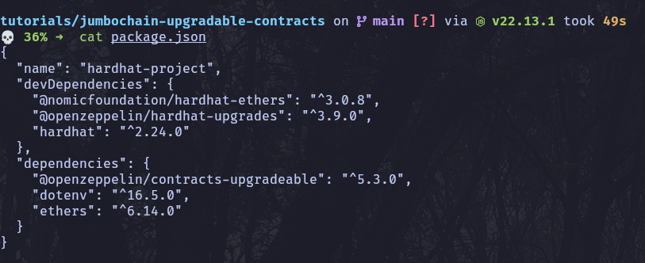

## Setting up your project

Create a new directory for your project and navigate to it:

```bash
mkdir jumbochain-upgradable-contracts
cd jumbochain-upgradable-contracts
```

Install hardhat globally with:

```bash
npm install --global hardhat
```

Initialize hardhat project with

```bash
npx hardhat init
```

Choose empty config option like following:


Install dependency prompted by tool, for my case it was:

```bash
npm install --save-dev "hardhat@^2.23.0"
```

Install dependencies that we are going to need in upcoming task:

```bash
npm install @openzeppelin/contracts-upgradeable

npm install --save-dev @openzeppelin/hardhat-upgrades @nomicfoundation/hardhat-ethers @nomicfoundation/hardhat-toolbox

npm install dotenv ethers
```

After this your `package.json` should look similar to this:



## Create `.env` to manage variables

```bash
touch .env
```

Add this variables to the file (use your own private key and rpc url accordingly):

:::tip
RPC_URL=`https://testnode.jumbochain.org` is protojumbo testnet url.

Also you can use metamask to create wallet on testnet and retrieve private key to use here.

:::

```bash
RPC_URL="https://testnode.jumbochain.org"
OWNER_KEY="2a3569dbc2f6afb8ad94eb65ac23d8530538b3ed153d8dfae26e163c80fcbbad"

```

## Configure Hardhat

Now lets modify `hardhat.config.js` to include the network configuration for Jumbo Blockchain:

```javascript title="hardhat.config.js"
require("@nomicfoundation/hardhat-toolbox");
require("@openzeppelin/hardhat-upgrades");
require("@nomicfoundation/hardhat-ethers");
require("dotenv").config();

/** @type import('hardhat/config').HardhatUserConfig */
module.exports = {
  solidity: {
    compilers: [
      {
        version: "0.8.20"
      }
    ]
  },
  networks: {
    hardhat: {},
    jumbochain: {
      url: process.env.RPC_URL || "https://testnode.jumbochain.org",
      accounts: [`${process.env.OWNER_KEY}`],
    }
  }
};

```

## Writing upgradeable contracts

### Initial contract

Lets create the first version of the contract ContractV1.sol in contracts directory.

```solidity title="contracts/ContractV1.sol"
// SPDX-License-Identifier: MIT
pragma solidity ^0.8.20;

// Upgradeable contract ke liye initializer use karte hain
import "@openzeppelin/contracts-upgradeable/proxy/utils/Initializable.sol";

contract ContractV1 is Initializable {
    uint256 public storedNumber;

    function initialize() public initializer {
        storedNumber = 42;  // Set a default value
    }


    function setStoredNumber(uint256 _newNumber) public {
        storedNumber = _newNumber;
    }


    function getStoredNumber() public view returns (uint256) {
        return storedNumber;
    }
}
```

### Deploying the initial implementation

Create a deployment script (scripts/deployV1.js) for the deployment as follows.

```javascript title="scripts/deployV1.js"
const { ethers, upgrades } = require("hardhat");

async function main() {
  const contractV1 = await ethers.getContractFactory("ContractV1");

  console.log("Deploying MyContractV1...");

  const proxy = await upgrades.deployProxy(contractV1, []);

  await proxy.waitForDeployment();

  console.log("contractV1 Proxy deployed to", await proxy.getAddress());
}

main();

```

Run the deployment script using:

```bash
npx hardhat run scripts/deployV1.js --network jumbochain
```

After deployment output should look similar to this:


Now lets pick up the contract address and add to the `.env` file, we will use it
in next steps.

Now `.env` should look similar to this.

```bash
➜  cat .env
RPC_URL="https://testnode.jumbochain.org"
OWNER_KEY="2a3569dbc2f6afb8ad94eb65ac23d8530538b3ed153d8dfae26e163c80fcbbad"
CONTRACT_V1_ADDRESS="0x7Fa17d6FF0000cB5E0166d4ab2fe34Ea5f6C8f3F"

```

### Upgraded version

Next, create the second version of the contract `ContractV2.sol` that
extends `ContractV1` and introduces new functionality:

```solidity title="contracts/ContractV2.sol"
// SPDX-License-Identifier: MIT
pragma solidity ^0.8.20;

import "@openzeppelin/contracts-upgradeable/proxy/utils/Initializable.sol";
import "./ContractV1.sol";

contract ContractV2 is ContractV1 {
    function doubleStoredNumber() public {
        storedNumber = storedNumber * 2;
    }
}
```

Initial contract (ContractV1) is already deployed, now we will upgrade it using
the script.

### Deploy upgrade

Create an upgrade script (scripts/deployV2.js):

```javascript title="scripts/deployV2.js"
const { ethers, upgrades } = require("hardhat");
const CONTRACT_V1_ADDRESS  = process.env.CONTRACT_V1_ADDRESS;

async function main() {
  const contractV2 = await ethers.getContractFactory("ContractV2");

  console.log("Upgrading to ContractV2...");
  const upgraded = await upgrades.upgradeProxy(CONTRACT_V1_ADDRESS, contractV2);

  await upgraded.waitForDeployment();
  console.log("Upgrade done. ContractV2 deployed to: ", await upgraded.getAddress());
}

main();

```

Run the upgrade with:

```bash
npx hardhat run scripts/deployV2.js --network jumbochain
```

Output should look similar to this:


**As you can observe, both the initial deployed address and address after the upgrade are the same**

With next steps we will verify the if the functionality of V1 and upgrade V2 both are working on deployed contract.

## Interacting with the Contract

To interact with the deployed contract, use simple scripts for reading and writing data.

### Use `ContractV1` functionality

```javascript title="scripts/setStoredNumber.js"
const { ethers } = require("hardhat");
require("dotenv").config();

async function main() {
  const CONTRACT_V1_ADDRESS = process.env.CONTRACT_V1_ADDRESS;

  if (!CONTRACT_V1_ADDRESS) {
    throw new Error("Please set CONTRACT_V1_ADDRESS in your .env file");
  }

  const contractV1 = await ethers.getContractFactory("ContractV1");
  const contract = contractV1.attach(CONTRACT_V1_ADDRESS);

  const newValue = 99; // You can change this value to any number

  const tx = await contract.setStoredNumber(newValue);
  await tx.wait();

  console.log(`Stored number successfully set to: ${newValue}`);
}

main().catch((err) => {
  console.error(err);
  process.exit(1);
});
```

Run the script with:

```bash
npx hardhat run scripts/setStoredNumber.js --network jumbochain
```

Output should look like this:

```bash
➜  npx hardhat run scripts/setStoredNumber.js --network jumbochain
Stored number successfully set to: 99

```

Verify we have correctly used `setStoredNumber` functionality by fetching the
stored number value from contract.

```javascript title="scripts/getStoredNumber.js"
const { ethers } = require("hardhat");
require("dotenv").config();

async function main() {
  const CONTRACT_V1_ADDRESS = process.env.CONTRACT_V1_ADDRESS;

  if (!CONTRACT_V1_ADDRESS) {
    throw new Error("Please set CONTRACT_V1_ADDRESS in your .env file.");
  }

  const contractV1 = await ethers.getContractFactory("ContractV1");
  const contract = contractV1.attach(CONTRACT_V1_ADDRESS);

  const storedNumber = await contract.getStoredNumber();
  console.log("Stored number is:", storedNumber.toString());
}

main().catch((error) => {
  console.error(error);
  process.exitCode = 1;
});

```

Run the script with:

```bash
npx hardhat run scripts/getStoredNumber.js --network jumbochain
```

Output should look similar following and with this we have confirmed that
initial deployed `ContractV1` functionality.

```bash
➜  npx hardhat run scripts/getStoredNumber.js --network jumbochain
Stored number is: 99

```

### Use upgraded functionality added by `ContractV2`

Doubling the Stored Number:

```javascript title="scripts/doubleStoredNumber.js"
const { ethers } = require("hardhat");
require("dotenv").config();

async function main() {
  const CONTRACT_V1_ADDRESS = process.env.CONTRACT_V1_ADDRESS;

  if (!CONTRACT_V1_ADDRESS) {
    throw new Error("Please set CONTRACT_V1_ADDRESS in your .env file");
  }

  const contractV2 = await ethers.getContractFactory("ContractV2");
  const contract = contractV2.attach(CONTRACT_V1_ADDRESS);

  const tx = await contract.doubleStoredNumber();
  await tx.wait();

  console.log("Stored number doubled successfully.");
}

main().catch((err) => {
  console.error(err);
  process.exit(1);
});
```

Run the script with:

```bash
npx hardhat run scripts/doubleStoredNumber.js --network jumbochain
```

Should output this:

```bash
➜  npx hardhat run scripts/doubleStoredNumber.js --network jumbochain
Stored number doubled successfully.

```

Now run `getStoredNumber.js` again to verify the new value is doubled:

```bash
npx hardhat run scripts/getStoredNumber.js --network jumbochain
```

Output should look like this:

```bash
➜  npx hardhat run scripts/getStoredNumber.js --network jumbochain
Stored number is: 198
```

**Notice when using upgraded functionality the contract address remains same as
of the initially deployed contract i.e. `CONTRACT_V1_ADDRESS`.**

**Thus we have successfully
upgraded our contract using Transparent Proxy Pattern**
